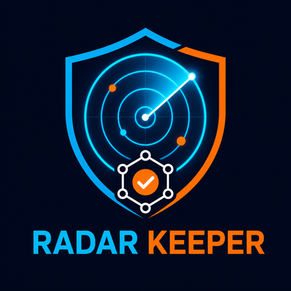

# Radar Keeper

**Autonomous market-risk detection with reliable onchain execution.**

Radar Keeper observes market signals, makes a confidence-gated risk decision,
enforces hard execution policies, and delegates a testnet transaction to
[KeeperHub](https://keeperhub.com/). Every decision and execution proof is
written to an append-only audit trail.

Built for **KeeperHub Agents Onchain**.



## Why it exists

An agent that can decide but cannot execute safely is only a chatbot with a
wallet. Radar Keeper treats execution discipline as part of the product:

- stale market data always results in `hold`;
- only a high-confidence sharp drop can trigger an action;
- the destination is allowlisted;
- KeeperHub must report an enabled testnet;
- every transaction is simulated before signing;
- live requests include an idempotency key;
- interrupted broadcasts retry with the exact same body and idempotency key;
- an unresolved broadcast blocks every differently keyed transfer;
- a daily value cap limits agent spend;
- repeated failures open a circuit breaker;
- every step is recorded for judges and operators.

## Execution flow

```text
Coinbase/demo signal
        ↓
confidence-gated decision
        ↓
cap + allowlist + circuit breaker
        ↓
KeeperHub testnet verification
        ↓
KeeperHub dry-run simulation
        ↓
idempotent testnet broadcast
        ↓
transaction link + audit trail
```

The KeeperHub sequence follows its official safe first-write guidance:
choose an enabled testnet, simulate the exact request, broadcast once with an
`Idempotency-Key`, and keep the returned execution and transaction proof.
If the client times out while KeeperHub is still executing, Radar Keeper
replays the same request with the same key. KeeperHub then returns the original
execution instead of creating a second transaction. If no proof can be
recovered, the action remains unresolved and the policy engine blocks new
transfers until a human reconciles it.

## Verified onchain execution

The end-to-end KeeperHub path has landed a real Ethereum Sepolia transaction:

- amount: `0.00001 Sepolia ETH`;
- block: `11379904`;
- status: successful;
- proof:
  [0x61078261...0cc46b3b](https://sepolia.etherscan.io/tx/0x610782610a42209ff816965eb618e8ec6c5d254f9f763f04f11b19da0cc46b3b).

The original HTTP call timed out just before KeeperHub returned. The chain
confirmed the transfer, and that incident is covered by the recovery tests in
this repository.

## Run locally

Requirements:

- Node.js 22+
- npm

```bash
npm install
npm run agent:dry
npm run dev
```

Open <http://localhost:3000>. The **Run safe demo** button exercises the full
signal, decision, policy, and audit path without credentials or funds.

## Connect KeeperHub

1. Sign in to [KeeperHub](https://app.keeperhub.com/).
2. Open **Settings → API Keys → Organisation**.
3. Create a key beginning with `kh_` and copy it immediately.
4. Open the KeeperHub wallet and fund it with a small amount of Sepolia ETH.
5. Copy `.env.example` to `.env.local`.
6. Set `KEEPERHUB_API_KEY` and an allowlisted Sepolia recipient address.

Keep live broadcast locked while validating:

```dotenv
LIVE_EXECUTION_ENABLED=false
```

Run a real KeeperHub simulation:

```bash
npm run agent:simulate
```

After reviewing the successful simulation and the configured cap, unlock one
testnet broadcast:

```dotenv
LIVE_EXECUTION_ENABLED=true
```

```bash
npm run agent:live
```

The dashboard displays KeeperHub's transaction link when execution completes.

## Commands

| Command | Purpose |
| --- | --- |
| `npm run dev` | Start the dashboard |
| `npm run agent:dry` | Local, credential-free demo cycle |
| `npm run agent:simulate` | KeeperHub testnet simulation only |
| `npm run agent:live` | Simulation followed by an idempotent testnet action |
| `npm test` | Unit and integration-style tests |
| `npm run typecheck` | TypeScript validation |
| `npm run build` | Production build |

## Security

- `KEEPERHUB_API_KEY` is server-only and never returned by an API route.
- `.env*` and runtime state are excluded from Git.
- Live execution is disabled unless explicitly unlocked.
- This prototype is testnet-first and is not production financial advice.

## Tech

Next.js, TypeScript, Node.js, KeeperHub Direct Execution API, Coinbase public
market data, and an append-only JSONL audit trail.

## License

MIT
